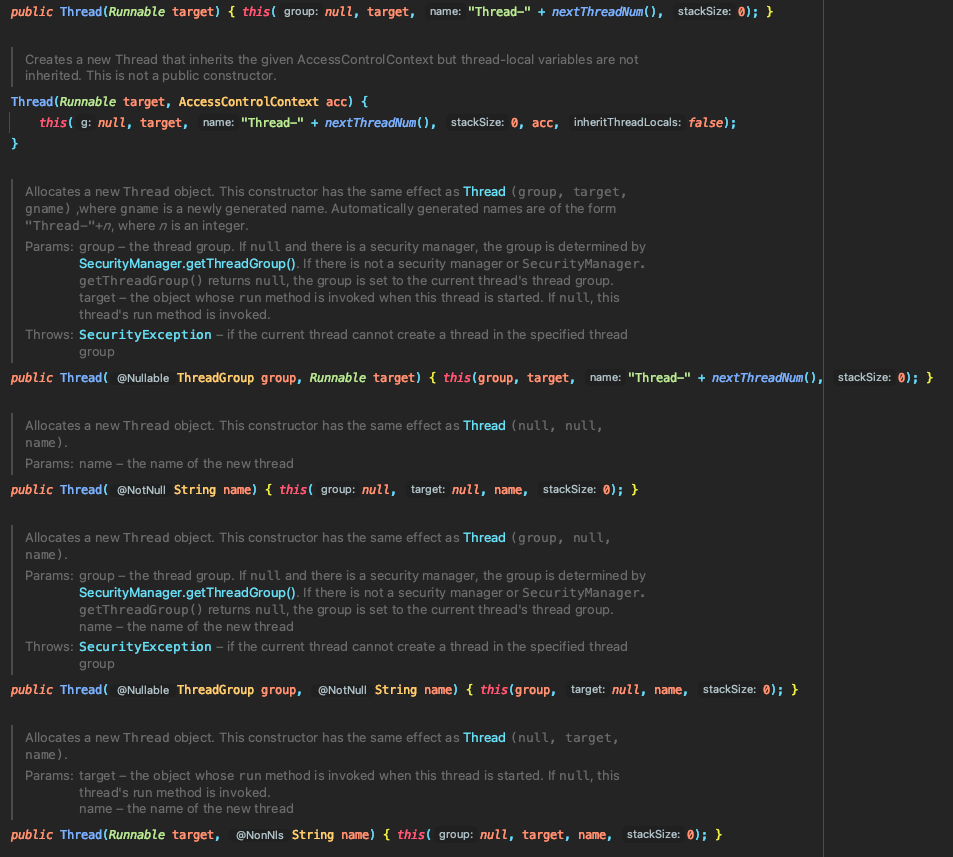

# CH3. 함수 정의와 호출
- 컬렉션, 문자열, 정규식을 다루기 위한 함수
- 이름 붙인 인자, 디폴트 파라미터 값, 중위 호출 문법 사용
- 확장 함수와 확장 프로퍼티를 사용해 자바 라이브러리 적용
- 최상위 및 로컬 함수와 프로퍼티를 사용해 코드 구조화

## 코틀린에서 컬렉션 만들기
코틀린은 자신만의 컬렉션 기능을 제공하지 않는다.<br> 
표준 자바 컬렉션을 활용하면 자바 코드와 상호작용하기가 훨씬 더 쉽다. 자바에서 코틀린 함수를 호출하거나 코틀린에서 자바 함수를 호출할 때 자바와 코틀린 컬렉션을 서로 변환할 필요가 없다. <br>

<br><br>
코틀린 컬렉션은 자바 컬렉션과 똑같은 클래스다. 하지만 코틀린에서는 자바보다 더 많은 기능을 쓸 수 있다. 예를 들어 리스트의 원소를 가져오거나 수로 이뤄진 컬렉션에서 최댓값을 찾을 수 있다.
```kotlin
    val strings = listOf("first", "second", "fourteenth")
    println(strings.last()) // fourteenth

    val numbers = setOf(1, 44, 2)
    print(numbers.maxOrNull()) // 44
```

## 함수를 호출하기 쉽게 만들기
```kotlin
    val list = listOf(1, 2, 3)
    println(list) // toString() 호출 
    // [1, 2, 3]
```
디폴트 toString 구현과 달리 `(1; 2; 3)`처럼 원소 사이를 세미콜론으로 구분하고 괄호로 리스트를 둘러싸고 싶은 경우가 있다. <br>
코틀린에는 이런 요구 사항을 처리할 수 있는 함수가 표준 라이브러리에 이미 존재하지만, 직접 함수를 구현해보자. <br>
(코틀린이 지원하는 기능을 사용하지 않고 직접 구현한 후, 좀 더 코틀린답게 같은 함수를 구현할 것)
```kotlin
fun <T> joinToString(
    collection: Collection<T>,
    separator: String,
    prefix: String,
    postfix: String
): String {
    val result = StringBuilder(prefix)

    for ((index, element) in collection.withIndex()) {
        if (index > 0) result.append(separator)
        result.append(element)
    }

    result.append(postfix)
    return result.toString()
}
```
```kotlin
    println(joinToString(list, "; ", "(", ")")) // (1; 2; 3)
```
위와 같이 `joinToString` 함수를 호출해 출력할 수 있다. 하지만 위의 함수는 호출할 때마다 매번 네 인자를 모두 전달한다.<br>
이제 개선해보자

### 이름 붙인 인자
함수를 호출하는 부분에서 가독성이 떨어지는 것을 알 수 있다. <br>
코틀린으로 작성한 함수를 호출할 때는 함수에 전달하는 인자 중 일부의 이름을 명시할 수 있다. <br>
호출 시 인자 중 어느 하나라도 이름을 명시하고 나면 혼동을 막기 위해 그 뒤에 오는 모든 인자는 이름을 꼭 명시해야 한다.<br>
> 이름 붙인 인자는 특히 디폴트 파라미터 값과 함께 사용할 때 쓸모가 많다.

### 디폴트 파라미터 값



<br>
위의 Thread 클래스 예시처럼, 자바에서는 일부 클래스에서 오버로딩한 메서드가 너무 많아진다는 문제가 있다.<br>
이러한 오버로딩은 하위 호환성을 유지하거나 API 사용자에게 편의를 더하는 등의 이유가 있지만 결론적으로 중복 코드라는 단점이 있다. <br>
<br>
코틀린에서는 함수 선언에서 파라미터의 디폴트 값을 지정할 수 있으므로 이런 오버로드 중 상당수를 피할 수 있다.

```kotlin
fun <T> joinToString(
    collection: Collection<T>,
    separator: String = ", ", // 디폴트 값이 지정된 파라미터 
    prefix: String = "",
    postfix: String = ""
): String {
    val result = StringBuilder(prefix)

    for ((index, element) in collection.withIndex()) {
        if (index > 0) result.append(separator)
        result.append(element)
    }

    result.append(postfix)
    return result.toString()
}
```


```kotlin
    println(joinToString(list, "; ", "(", ")"))
    println(joinToString(list))
    println(joinToString(list, prefix = "#", postfix = ";"))
```
함수의 디폴트 파라미터 값은 함수를 호출하는 쪽이 아니라 함수 선언 쪽에서 지정된다는 사실을 기억하자. 

### 정적인 유틸리티 클래스 없애기: 최상위 함수와 프로퍼티
객체지향 언어인 자바에서는 모든 코드를 클래스의 메서드로 작성해야 한다. 하지만 실전에서는 어느 한 클래스에 포함시키기 어려운 코드가 많이 생긴다.
<br>
일부 연산에는 비슷하게 중요한 역할을 하는 클래스가 둘 이상 있을 수도 있다. 중요한 객체는 하나뿐이지만 그 연산을 객체의 인스턴스 API에 추가해서 API를 너무 크게 만들고 싶지 않은 경우도 있다.<br>
그 결과 다양한 정적 메서드를 모아두는 역할만 담당하여, 특별한 상태나 인스턴스 메서드는 없는 클래스가 생겨난다.<br><br>
코틀린에서는 이런 무의미한 클래스가 필요 없다. 대신 함수를 직접 소스 파일의 최상위 수준, 모든 다른 클래스의 밖에 위치시키면 된다. <br>

`joinToString` 함수를 strings 패키지에 직접 넣어보자. `join.kt`라는 파일을 다음과 같이 작성해보자
```kotlin
package strings
fun joinToString(...): String { ... }
```

#### 최상위 프로퍼티
함수와 마찬가지로 프로퍼티도 파일의 최상위 수준에 놓을 수 있다. 
```kotlin
var opCount = 0; // 최상위 프로퍼티를 선언한다.

fun performOperation() { // 최상위 프로퍼티의 값을 변경한다.
    opCount++
}

fun reportOperationCount() { // 최상위 프로퍼티의 값을 읽는다.
    println("Operation performed $opCount times")
}
```
이런 프로퍼티의 값은 정적 필드에 저장된다. 최상위 프로퍼티를 활용해 코드에 상수를 추가할 수 있다.
```kotlin
val UNIX_LINE_SEPARATOR = "\n"
```
기본적으로 최상위 프로퍼티도 다른 모든 프로퍼티처럼 접근자 메서드를 통해 자바 코드에 노출된다.<br>
겉으론 상수처럼 보이는데, 실제로는 게터를 사용해야 한다면 자연스럽지 못하다. (`private static final`)<br>
더 자연스럽게 사용하려면 이 상수를 `public static final` 필드로 컴파일해야 한다. 
`const` 변경자를 추가하면 프로퍼티를 `public static final` 필드로 컴파일하게 만들 수 있다.
```kotlin
const val UNIX_LINE_SEPARATOR = "\n"
```

## 메서드를 다른 클래스에 추가: 확장 함수와 확장 프로퍼티

### 확장 함수
확장 함수는 어떤 클래스의 멤버 메서드인 것처럼 호출할 수 있지만 그 클래스의 밖에 선언된 함수다. <br>
확장 함수를 보여주기 위해 어떤 문자열의 마지막 문자를 돌려주는 메서드를 추가해보자.
```kotlin
package strings
fun String.lastChar(): Char = this[this.length - 1]
```
확장 함수를 만들려면 추가하려는 함수 이름 앞에 그 함수가 확장할 클래스의 이름을 덧붙이기만 하면 된다.<br>
클래스 이름을 수신 객체 타입(String)이라 부르며, 확장 함수가 호출되는 대상이 되는 값(객체)을 수신 객체라고 부른다.
```kotlin
"Kotlin".lastChar() // 일반 클래스 멤버를 호출하는 구문과 똑같다.
```
위의 예제에서는 String이 수신 객체 타입이고 "Kotlin"이 수신 객체다.
<br><br>
또한 일반 메서드와 마찬가지로 확장 함수 본문에서도 `this`를 생략할 수 있다.
```kotlin
package strings

fun String.lastChar(): Char = get(length - 1)
```

확장 함수 내부에서는 일반적인 인스턴스 메서드의 내부에서와 마찬가지로 수신 객체의 메서드나 프로퍼티를 바로 사용할 수 있다.
<br> 하지만 **확장 함수가 캡슐화를 깨지는 않는다**는 사실을 기억하자.<br>
_클래스 안에서 정의한 메서드와 달리_, 확장 함수 안에서는 클래스 내부에서만 사용할 수 있는 private 멤버나 protected 멤버를 사용할 수 없다.

#### 확장 함수로 유틸리티 함수 정의 
이제 `joinToString` 함수의 최종 버전을 만들어보자.
```kotlin
fun <T> Collection<T>.joinToString( // Collection<T>에 대한 확장 함수 선언
    separator: String = ", ",
    prefix: String = "",
    postfix: String = ""
): String {
    val result = StringBuilder(prefix)

    for ((index, element) in this.withIndex()) { // this: 수신 객체를 가리킨다. 여기서는 T 타입의 원소로 이뤄진 컬렉션이다.
        if (index > 0) result.append(separator)
        result.append(element)
    }

    result.append(postfix)
    return result.toString()
}
```
```kotlin
    val arrayList = arrayListOf(1, 2, 3)
    println(arrayList.joinToString(" "))
```
원소로 이뤄진 컬렉션에 대한 확장을 만든다. 이제 `joinToString`을 마치 클래스의 멤버인 것처럼 호출할 수 있다.

<br><br>

### 확장 함수는 오버라이드할 수 없다
확장 함수는 클래스의 일부가 아니다. 확장 함수는 클래스 밖에 선언된다. <br>
이름과 파라미터가 완전히 같은 확장 함수를 기반 클래스와 하위 클래스에 대해 정의해도 실제로는 확장 함수를 호출할 때 수신 객체로 지정한 변수의 정적 타입에 의해 어떤 확장 함수가 호출될지 결정될지, 그 변수에 저장된 객체의 동적인 타입에 의해 확장 함수가 결정되지 않는다.
확장 함수를 첫 번째 인자가 수신 객체인 정적 자바 메서드로 컴파일 한다! 코틀린은 호출될 확장 함수를 정적으로 결정한다. 
```kotlin
fun View.showOff() = println("I'm a view")
fun Button.showOff() = println("I'm a button")

val view: View = Button()

// 확장 함수는 정적으로 결정된다.
view.showOff() // I'm a view
```
> `maxOrNull()`과 `last()` 같이 자바보다 더 많은 기능을 쓸 수 있다고 했는데, 모두 확장 함수였던 것이다!

### 확장 프로퍼티
확장 프로퍼티를 사용하면 기존 클래스 객체에 대한 프로퍼티 형식의 구문으로 사용할 수 있는 API를 추가할 수 있다. <br>
프로퍼티라는 이름을 갖고 있지만 상태를 저장할 적절한 방법이 없기 때문에(기존 클래스의 인스턴스 객체에 필드를 추가할 방법은 없다.) 실제로 확장 프로퍼티는 아무 상태도 가질 수 없다.<br>
하지만 프로퍼티 문법으로 더 짧게 코드를 작성할 수 있어서 편한 경우가 있다. 

- 확장 프로퍼티 선언하기
```kotlin
val String.lastChar: Char
    get() = get(length - 1)
```
뒷받침하는 필드가 없어서 기본 게터 구현을 제공할 수 없으므로 최소한 게터는 꼭 정의해야 한다.<br>
초기화 코드에서 계산한 값을 담을 장소가 전혀 없으므로 초기화 코드도 쓸 수 없다.

- 변경 가능한 확장 프로퍼티 선언하기
```kotlin
var StringBuilder.lastChar: Char
    get() = get(length - 1) 
    set(value: Char) {
        this.setCharAt(length - 1, value) // 프로퍼티 세터 
    }
```

## 컬렉션 처리

### 가변 인자 함수: 인자의 개수가 달라질 수 있는 함수 정의
리스트를 생성하는 함수를 호출할 때 원하는 만큼 많이 원소를 전달할 수 있다.
```kotlin
val list = listOf(2, 3, 5, 7, 11)
```
라이브러리에서 해당 함수의 정의를 보자.
```kotlin
fun listOf<T>(varang values: T): List<T> { ... }
```
가변 길이 인자는 메서드를 호출할 때 원하는 개수만큼 값을 인자로 넘기면 자바 컴파일러가 배열에 그 값들을 넣어주는 기능이다.<br>
코틀린의 가변 길이 인자는 파라미터 앞에 varang 변경자를 붙이다. (자바에서는 타입 뒤에 ...를 붙인다.) <br>
이미 배열에 들어있는 원소를 가변 길이 인자로 넘길 때도 코틀린과 자바 구문이 다르다. 자바에서는 배열을 그냥 넘기면 되지만, 코틀린에서는 배열을 명시적으로 풀어서 배열의 각 원소가 인자로 전달되게 해야 한다.<br>
기술적으로는 **스프레드 연산자**가 그런 작업을 해준다.
```kotlin
fun main(args: Array<String>) {
    val list = listOf("args: ", *args) 
    println(list)
}
```

### 값의 쌍 다루기: 중위 호출과 구조 분해 정의
맵을 만들려면 `mapOf` 함수를 사용한다.
```kotlin
val map = mapOf(1 to "one", 7 to "seven")
```
`to`라는 단어는 키워드가 아니라 **중위 호출**이라는 특별한 방식으로 `to`라는 일반 메서드를 호출한 것이다. <br>
중위 호출 시에는 수신 객체와 유일한 메서드 인자 사이에 메서드 이름을 넣는다.
```kotlin
1.to("one") // to 메서드를 일반적인 방식으로 호출함
1 to "one"  // to 메서드를 중위 호출 방식으로 호출함
```
인자가 하나뿐인 일반 메서드나 인자가 하나뿐인 확장 함수에 중위 호출을 사용할 수 있다.<br>
함수를 중위 함수에 사용하게 허용하고 싶으면 `infix` 변경자를 함수 선언 앞에 추가해야 한다.
```kotlin
infix fun Any.to(other: Any) = Pair(this, other)
```
이 to 함수는 Pair의 인스턴스를 반환한다. Pair는 코틀린 표준 라이브러리 클래스로, 그 이름대로 두 원소로 이뤄진 순서쌍을 표현한다.<br>
Pair의 내용으로 두 변수를 즉시 초기화할 수 있다.
```kotlin
val (number, name) = 1 to "one"
```
이런 기능을 구조 분해 선언이라고 부른다.

## 코드 다듬기: 로컬 함수와 확장 
많은 개발자들이 좋은 코드의 중요한 특징 중 하나가 중복이 없는 것이라 믿는다. <br>
그래서 그 원칙에는 반복하지 말라(DRY, Don't Repeat Yourself) 라는 이름도 붙어있다.<br>
코틀린에서는 함수에서 추출한 함수를 원 함수 내부에 중첩시킬 수 있다. 그렇게 하면 문법적인 부가 비용을 들이지 않고도 깔끔하게 코드를 조직할 수 있다.<br>
흔히 발생하는 코드 중복을 로컬 함수를 통해 어떻게 제거할 수 있는지 살펴보자.
<br><br>
다음 리스트에는 사용자를 데이터베이스에 저장하는 함수가 있다. 이때 데이터베이스에 사용자 객체를 저장하기 전에 각 필드를 검증해야 한다.
- 코드 중복을 보여주는 예제
```kotlin
class User(val id: Int, val name: String, val address: String)

fun saveUser(user: User) {
    if (user.name.isEmpty()) {
        throw ~ 
    }
    if (user.address.isEmpty()) {
        throw ~
    }
    // user를 데이터베이스에 저장한다.
}
```
여기서는 코드 중복이 많진 않지만, 클래스가 사용자의 필드를 검증할 때 필요한 여러 경우를 하나씩 처리하는 메서드로 넘쳐나기를 바라지는 않을 것이다. <br>
이런 경우 검증 코드를 로컬 함수로 분리하면 중복을 없애는 동시에 코드 구조를 깔끔하게 유지할 수 있다.
<br> 로컬 함수는 자신이 속한 바깥 함수의 모든 파라미터와 변수를 사용할 수 있다.
```kotlin
class User(val id: Int, val name: String, val address: String)

fun saveUser(user: User) {
    fun validate(value: String, fieldName: String) { // 한 필드를 검증하는 로컬 함수를 정의한다.
        if (value.isEmpty()) {
            throw IllegalArgumentException(
                "Can't save user ${user.id}: " + // 바깥 함수의 파라미터에 직접 접근 가
                        "empty $fieldName"
            )
        }
    }
    validate(user.name, "Name")
    validate(user.address, "Address")
    // user를 데이터베이스에 저장한다.
}
```

위 예제를 더 개선하고 싶다면 검증 로직을 User 클래스를 확장한 함수로 만들 수도 있다.
- 검증 로직을 확장 함수로 추출하기 
```kotlin
class User(val id: Int, val name: String, val address: String)

fun User.validateBeforeSave() {
    fun validate(value: String, fieldName: String) { // 한 필드를 검증하는 로컬 함수를 정의한다.
        if (value.isEmpty()) {
            throw IllegalArgumentException(
                "Can't save user ${user.id}: " + // 바깥 함수의 파라미터에 직접 접근 가
                        "empty $fieldName"
            )
        }
    }
    validate(user.name, "Name")
    validate(user.address, "Address")
}

fun saveUser(user: User) {
    user.validateBeforeSave() // 확장 함수를 호출한다.
    // user를 데이터베이스에 저장한다.
}
```
코드를 확장 함수로 뽑아내는 기법은 놀랄 만큼 유용하다. User는 라이브러리에 있는 클래스가 아니라 여러분 자신의 코드 기반에 있는 클래스지만, 이 경우 검증 로직은 User를 사용하는 다른 곳에서는 쓰이지 않는 기능이기 때문에 User에 포함시키고 싶지는 않다.
<br>
User를 간결하게 유지하면 생각해야 할 내용이 줄어들어서 더 쉽게 코드를 파악할 수 있다. 반면 한 객체만을 다루면서 객체의 비공개 데이터를 다룰 필요는 없는 함수는 확장 함수로 만들면 `객체.멤버`처럼 수신 객체를 지정하지 않고도 공개된 멤버 프로퍼티나 메서드에 접근할 수 있다.

## 요약
- 코틀린은 자체 컬렉션 클래스를 정의하지 않지만 자바 클래스를 확장해서 더 풍부한 API를 제공한다.
- 함수 파라미터의 디폴트 값을 정의하면 오버로딩한 함수를 정의할 필요성이 줄어든다. 이름 붙인 인자를 사용하면 함수 호출의 가독성을 더 향상시킬 수 있다.
- 코틀린 파일에서는 클래스 멤버가 아닌 최상위 함수와 프로퍼티를 직접 선언할 수 있따. -> 코드 구조의 유연성
- 중위 호출을 통해 인자가 하나밖에 없는 메서드나 확장 함수를 더 깔끔한 구문으로 호출할 수 있다.
- 로컬 함수를 써서 코드를 더 깔끔하게 유지하면서 중복을 제거할 수 있다.
