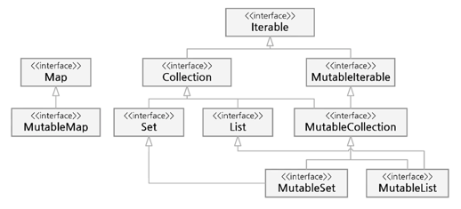

# 컬렉션(Collection)
자주 사용되는 기초적인 자료구조를 모아놓은 일종의 프레임워크로 표준 라이브러리로 제공한다.

## 코틀린의 컬렉션
컬렉션의 종류로는 List, Set, Map 등이 있으며 _자바와는 다르게_ 불변형(immutable)과 가변형(mutable)으로 나뉘어 컬렉션을 다룰 수 있다.

|컬렉션|불변형(읽기 전용)|가변형|
|---|---|---|
|List|listOf|mutableListOf, arrayListOf|
|Set|setOf|mutableSetOf, hashSetOf, linkedSetOf, sortedSetOf|
|Map|mapOf|mutableMapOf, hashMapOf, linkedMapOf, sortedMapOf|


다이어그램의 가장 상위의 Iterable 인터페이스는 컬렉션이 연속적인 요소를 표현할 수 있게 한다.
  

### Collection 인터페이스
- Iterable 로부터 확장
- **불변형**이므로 Collection으로부터 확장된 Set과 List는 읽기 전용의 컬렉션이 된다.

#### Collection 인터페이스 멤버

|멤버|설명|
|---|---|
|size|컬렉션의 크기를 나타낸다.|
|isEmpty()|컬렉션이 비어 있는 경우 true를 반환한다.|
|contains(element: E)|특정 요소가 있다면 true를 반환한다.|
|containsAll(element: `Collection<E>`)|인자로 받아들인 Collection이 있다면 true를 반환한다.|

### MutableIterable과 MutableCollection 인터페이스
- 가변형 컬렉션을 지원하기 위해 준비된 인터페이스이다.
- 요소를 추가하거나 제거하는 등의 기능을 수행할 수 있다.

|멤버 메서드|설명|
|---|---|
|add(element: E)|인자로 전달받은 요소를 추가하고 true를 반환하며, 이미 요소가 있거나 중복이 허용되지 않으면 false를 반환한다.|
|remove(element: E)|인자로 받은 요소를 삭제하고 true를 반환하며, 삭제하려는 요소가 없다면 false를 반환한다.|
|addAll(elements: `Collection<E>`|컬렉션을 인자로 전달받아 모든 요소를 추가하고 true를 반환하며, 실패 시 false를 반환한다.|
|removeAll(elements: `Collection<E>`)|컬렉션을 인자로 전달받아 모든 요소를 삭제하고 true를 반환하며, 실패 시 false를 반환한다.|
|retainAll(elements: `Collection<E>`)|인자로 전달받은 컬렉션의 요소만 보유한다. |
|clear()| 컬렉션의 모든 요소를 삭제한다.|

### List
- 순서에 따라 정렬된 요소를 가지는 컬렉션 (가장 많이 사용되는 컬렉션 중 하나)
- 값을 변경할 수 없는 불변형 List를 만들기 위해 **헬퍼 함수**인 listOf()를 사용한다.
- 값을 변경할 수 있는 가변형을 표현하기 위해서는 mutableListOf()를 사용한다.
- 인자는 원하는 만큼의 가변 인자를 가지도록 vararg로 선언 가능하다.

#### 헬퍼 함수
객체 생성 시 요소를 직접 선언하기보다 특정 함수의 도움을 통해 생성한다.
> 보통 헬퍼 함수를 통해서 요소를 초기화한다.

#### 불변형 List 생성하기
헬퍼 함수 listOf()의 원형
```kotlin
public fun <T> listOf(vararg elements: T): List<T>
```
- vararg는 가변 인자를 받을 수 있기 때문에 원하는 만큼 요소를 지정할 수 있다.
- 값을 반환할 때 `List<T>`를 사용한다.
- 형식 매개변수 `<T>`는 필요에 따라 원하는 자료형을 지정해 선언한다.
  - 사용하지 않으면 `<Any>`가 기본값이며 어떤 자료형이든 혼합 사용 가능하다. 

### 컬렉션에 접근할 때 
- for, .indices 멤버를 통한 접근
```kotlin
for (index in fruits.indices) { // 인덱스 지정
    println("fruits[$index] = ${fruits[index]}")
}
```

### 기타 List 생성 함수
- emptyList() 함수<br>
빈 리스트를 생성한다.
```kotlin
val emptyList: List<String> = emptyList<String>()
```

- listOfNotNull() 함수<br>
null을 제외한 요소만 반환
```kotlin
// null이 아닌 요소만 골라 컬렉션을 초기화한다.
val nonNullsList: List<Int> = listOfNotNull(2, 45, 2, null, 5, null)
println(nonNullsList) // [2, 45, 2, 5]
```

### 가변형 List 생성
- arrayListOf() 함수 
  - 가변형 헬퍼 함수를 사용하면 손쉽게 요소를 추가하거나 삭제할 수 있다. 
  - arrayListOf()는 가변형 List를 생성하지만 반환자료형은 자바의 ArrayList이다.
```kotlin
public fun <T> arrayListOf(vararg elements: T): ArrayList<T>
```

## List와 배열의 차이
- Array 클래스에 생성되는 배열 객체는 내부 구조상 고정된 크기를 가지고 있다.
- 코틀린의 `List<T>`와 `MutableList<T>`는 인터페이스로 설계되어 있고 이것을 하위에서 특정한 자료구조로 구현한다.
<br>(`LinkedList<T>`, `ArrayList<T>`)
```kotlin
val list1: List<Int> = LinkedList<Int>()
val list2: List<Int> = ArrayList<Int>()
```
고정된 크기의 메모리가 아니기 때문에 자료구조에 따라 늘리거나 줄이는 것이 가능하다. 
- `Array<T>`는 제네릭 관점에서 상/하위 자료형 관게가 성립하지 않는 **무변성**이다.

## Set 
- 정해진 순서가 없는 요소들의 집합
- 집합의 개념이기 때문에 동일한 요소를 중복해서 가질 수 없다.
- 생성 헬퍼 함수
  - 불변형 Set: `setOf()`
  - 가변형 Set: `mutableSetOf()`

### Set의 여러 가지 자료구조
- hashSet() 함수
  - 이 헬퍼 함수를 통해 생성하면 해시 테이블에 요소를 저장할 수 있는 자바의 HashSet 컬렉션을 만든다.
  - HashSet은 불변성 선언이 없기 때문에 추가 및 삭제 등의 기능을 수행할 수 있다.
    - 정렬 기능은 없지만 해시값을 통해 요소를 찾아내므로 검색 속도는 O(1)의 탐색 시간이 걸린다.
- 해시 테이블(Hash Table)<br>
해시 테이블이란 내부적으로 키와 인덱스를 이용해 검색과 변경 등을 매우 빠르게 처리할 수 있는 자료구조이다.
  
### 자바의 TreeSet 컬렉션
- sortedSetOf() 함수
  - 자바의 TreeSet 컬렉션을 정렬된 상태로 반환한다.
  - java.util.* 패키지를 임포트해야 한다.
  - TreeSet은 저장된 데이터의 값에 따라 정렬: 이진 탐색 트리인 RB(red-black) 트리 알고리즘을 사용한다.
  - HashSet보다 성능이 좀 떨어지고 데이터를 추가하거나 삭제하는 데 시간이 걸리지만 검색과 정렬이 뛰어나다.

### 자바의 LinkedHashSet
- linkedSetOf() 함수
  - 자바의 LinkedHashSet 자료형을 반환하는 헬퍼 함수
  - 자료구조 중 하나인 Linked-list를 사용해 구현된 해시 테이블에 요소를 저장한다.
  - HashSet, TreeSet보다 느리지만 데이터 구조상 다음 데이터를 가리키는 포인터 연결을 통해 **메모리 저장 공간을 좀 더 효율적으로 사용**한다.
  

## Map
- 키와 값으로 구성된 요소를 저장한다. (키와 값은 모두 객체)
- 키는 중복될 수 없지만 값은 중복 저장될 수 있다.
- Map의 생성
  - 불변형: mapOf()
  - 가변형: mutableMapOf()

### 불변령 Map의 생성 
- mapOf() 함수
```kotlin
val map: Map<키자료형, 값자료형> = mapOf(키 to 값[, ...])
```
키와 쌍은 '키 to 값' 형태로 나타낸다.
- MutableMap의 추가 멤버: 추가, 삭제가 가능한 메서드를 제공한다.
- put, remove, putAll, clear

### 확장 함수
#### 요소 집계를 위한 확장 함수 
- forEach, forEachIndexed, onEach, count, max, min, maxBy, minBy, fold, reduce, sumBy 등
- 요소의 순환
  - forEach: 각 요소를 람다식을 처리한 후, 컬렉션을 반환하지 않는다.
  - onEach: 각 요소를 람다식으로 처리한 후 컬렉션을 반환 받는다.
- 각 요소의 정해진 식 적용
  - fold와 reduce: 초기값과 정해진 식에 따라 요소 처리
    - fold는 초기값과 정해진 식에 따라 처음 요소부터 끝 요소에 적용해 값을 반환한다.
    - reduce는 fold와 동일하지만 초기값을 사용하지 않는다.
  - foldRight, reduceRight: 위의 개념과 동일하지만 요소의 마지막 요소에서 처음 요소로 순서대로 적용한다.
  
#### 매핑 관련 연산
map()
- 주어진 컬렉션의 요소를 일괄적으로 모든 요소에 식을 적용해 새로운 컬렉션을 만든다.
- forEach 와는 다르게 주어진 컬렉션을 건드리지 않는다.

flatMap()
- 각 요소에 식을 적용한 후 이것을 다시 하나로 합쳐 새로운 컬렉션을 반환한다.
```kotlin
println(list.flatMap { listOf(it, 'A') })
// [1, A, 2, A, 3, A, 4, A, 5, A, 6, A]
val result = listOf("abc", "12").flatMap { it.toList() }
// 요소에 toList()를 사용하면 "abc"는 a, b, c 처럼 분해되어 리스트 컬렉션으로 만들어진다.
println(result)
// [a, b, c, 1, 2]
```


groupBy()
- 주어진 식에 따라 요소를 그룹화하고 이것을 다시 Map으로 반환한다.
```kotlin
val grpMap = list.groupBy { if (it % 2 == 0) "even" else "odd" }
println(grpMap)
// {odd=[1, 3, 5], even=[2, 4, 6]}
```

### 요소 처리와 검색 
element 관련 연산
- 보통 인덱스와 함께 해당 요소의 값을 반환한다.
- 식에 따라 처리하거나 인덱스를 벗어나면 null을 반환한다.

### 순서와 정렬 연산
- reversed()
- sorted() / sortedDescending()
- sortedBy { it % 3 } / sortedByDescending { it % 3 }

## 시퀀스(sequence)
(끝나지 않고 게속 값을 발생하는 무한 요소에 대해 생각해보자.)
- 순차적으로 요소의 크기를 특정하지 않고 추후에 결정하는 특수한 컬렉션
- 예를 들어, 특정 파일에서 줄 단위로 읽어서 요소를 만들 때
- 시퀀스는 처리 중에는 계산하고 있지 않다가 toList()나 count() 같은 최종 연산에 의해 결정된다.

### 요소 값 생성 
generateSequence
- 시드(seed) 인수에 의해 시작 요소의 값이 결정된다.
```kotlin
// 시드값 1을 시작으로 1씩 증가하는 시퀀스를 정의한다.
val nums: Sequence<Int> = generateSequence(1) { it + 1 }

// take()을 사용해 원하는 요소 개수만큼 획득하고
// toList()를 사용해 List 컬렉션으로 반환한다.
println(nums.take(10).toList())
// [1, 2, 3, 4, 5, 6, 7, 8, 9, 10]
```

- map이나 fold 같은 연산을 같이 사용한다.
```kotlin
val squares = generateSequence(1) { it + 1 }.map { it * it }
println(squares.take(10).toList())
// [1, 4, 9, 16, 25, 36, 49, 64, 81, 100]

val oddSquares = squares.filter { it % 2 != 0 }
println(oddSquares.take(10).toList())
// [1, 9, 25, 49, 81, 121, 169, 225, 289, 361]
```
메서드 체이닝(chaining)해 연속해서 쓴다면 하나의 구문이 끝날 때마다 중간 결과로 새로운 List를 계속해서 만들어 낸다.


<br>

asSequence()
- 중간 연산 결과 없이 한 번에 끝까지 연산한 후 결과를 반환한다.
  - filter나 map을 메서드 체이닝해서 사용할 경우 순차적 연산이기 때문에 시간이 많이 걸릴 수 있지만 <br>
asSequence()를 사용하면 **병렬 처리**되기 때문에 처리 성능이 좋아진다.
```kotlin
    // 단순 메서드 체이닝 사용하는 경우
    val list1 = listOf(1, 2, 3, 4, 5)
    val listDefault = list1
        .map { print("map($it) "); it * it }
        .filter { println("filter($it) "); it % 2 == 0 }

    println(listDefault)
    /*
        map(1) map(2) map(3) map(4) map(5) filter(1)
        filter(4)
        filter(9)
        filter(16)
        filter(25)
        [4, 16]
     */

    // asSequence() 사용해보기
    val listSequence = list1.asSequence()
        .map { print("map($it) "); it * it }
        .filter { println("filter($it) "); it % 2 == 0}
        .toList()

    println(listSequence)
    /*
        map(1) filter(1)
        map(2) filter(4)
        map(3) filter(9)
        map(4) filter(16)
        map(5) filter(25)
        [4, 16]
     */

```
- 최종 결과를 List 목록으로 반환할 때, 모든 연산이 수행되고 결과물이 새로운 리스트인 listSequence에 지정된다.
- 요소의 개수가 많을 때 속도나 메모리 측면에서 훨씬 좋은 성능을 낼 수 있다.