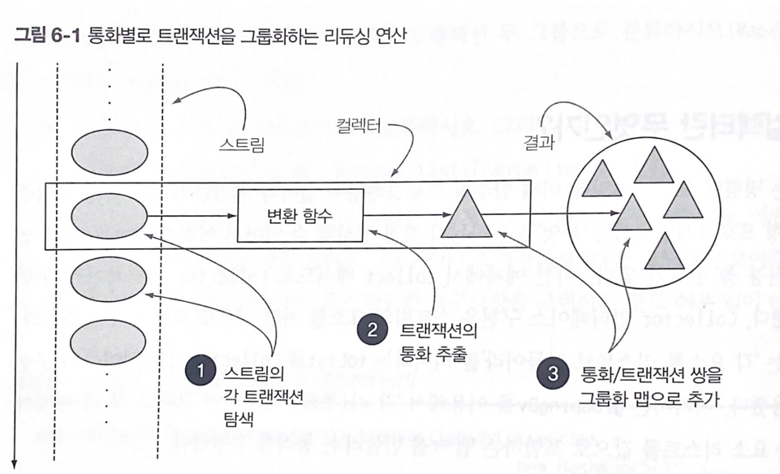
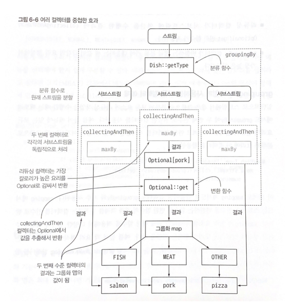

# CH6. 스트림으로 데이터 수집
- Collectors 클래스로 컬렉션을 만들고 사용하기
- 하나의 값으로 데이터 스트림 리듀스하기
- 특별한 리듀싱 요약 연산
- 데이터 그룹화와 분할
- 자신만의 커스텀 컬렉터 개발

<br>
중간 연산은 한 스트림을 다른 스트림으로 변환하는 연산으로서, 여러 연산을 연결할 수 있다. 중간 연산은 스트림 파이프라인을 구성하며, 스트림의 요소를 소비하지 않는다.<br>
반면, 최종 연산은 스트림의 요소를 **소비**해서 최종 결과를 도출한다.

4장, 5장에서는 스트림에서 최종 연산 `collect`를 사용하는 방법을 확인했다. `reduce`가 그랬던 것처럼 `collect` 역시 다양한 요소 누적 방식을 인수로 받아서 스트림을 최종 결과로 도출하는 리듀싱 연산을 수행할 수 있음을 설명한다.  <br>
다양한 요소 누적 방식은 **`Collector`** 인터페이스에 정의되어 있다.
> 컬렉션(Collections), 컬렉터(Collector), collect는 서로 다르다.

## 컬렉터란 무엇인가?
함수형 프로그래밍에서는 '무엇'을 원하는지 직접 명시할 수 있어서 어떤 방법으로 이를 얻을지는 신경 쓸 필요가 없다. <br>
`Collector` 인터페이스 구현은 스트림의 요소를 어떤 식으로 도출할지 지정한다. 
```java
Map<Currency, List<Transaction>> transactionByCurrencies = 
    transactions.stream().collect(groupingBy(Transaction::getCurrency))
```
위의 예제에서는 `groupingBy`를 이용해서 "각 키(통화) 버킷 그리고 각 키 버킷에 대응하는 요소 리스트를 값으로 포함하는 Map을 만들라"는 동작을 수행한다.
다수준(multilevel)으로 그룹화를 수행할 때 명령형 프로그래밍과 함수형 프로그래밍의 차이점이 더 두드러진다. <br>
명령형 코드에서는 문제를 해결하는 과정에서 다중 루프와 조건문을 추가하여 가독성과 유지보수성이 크게 떨어진다.
```java
// 그룹화한 트랜잭션을 저장할 맵을 생성한다. 
Map<Currency, List<Transaction>> transactionByCurrencies = 
                                                new HashMap<>();

// 트랜잭션 리스트 반복 
for (Transaction transaction: transactions) {
    Currency currency = transaction.getCurrency(); // 트랜잭션의 통화 추출
    List<Transaction> transactionsForCurrency = 
            transactionsByCurrencies.get(currency);
    if (transactionsForCurrency == null) {
        transactionsForCurrency = new ArrayList<>();
        transactionsByCurrencies.put(currency, transactionsForCurrency);
    }
    transactionsForCurrency.add(transaction); // 같은 통화를 가진 트랜잭션 리스트에 현재 탐색 중인 트랜잭션을 추가한다.
}
```

### 고급 리듀싱 기능을 수행하는 컬렉터
함수형 API의 또 다른 장점으로 높은 수준의 **조합성과 재사용성**이 있다. <br>
스트림에 `collect`를 호출하면 스트림의 요소에 (컬렉터로 파라미터화된) 리듀싱 연산이 수행된다.<br><br>
<br> 내부적으로 리듀싱 연산이 일어나는 모습을 보여준다.

보통 함수를 요소로 변환(`toList`처럼 데이터 자체를 변환하는 것보다는 **데이터 저장 구조를 변환할 때가 많다.**)할 때는 컬렉터를 적용하며 최종 결과를 저장하는 자료구조에 값을 누적한다. <br>
예를 들어, 트랜잭션 그룹화 예제에서 변환 함수는 각 트랜잭션에서 통화를 추출한 다음에 통화를 키로 사용해서 트랜잭션 자체를 결과 맵에 누적했다. 
<br><br>
`Collectors`에서 제공하는 메서드의 기능은 크게 세 가지로 구분할 수 있다. 
- 스트림 요소를 하나의 값으로 리듀스하고 요약
- 요소 그룹화 
- 요소 분할 : 프레디케이트를 그룹화 함수로 사용한다.

## 리듀싱과 요약

컬렉터(Stream.collect 메서드의 인수)로 스트림의 항목을 컬렉션으로 재구성할 수 있다. 좀 더 일반적으로 말해 컬렉터로 스트림의 모든 항목을 하나의 결과로 합칠 수 있다. 

### 스트림값에서 최댓값과 최솟값 검색 
메뉴에서 칼로리가 가장 높은 요리를 찾는다고 가정하자
```java
Comparator<Dish> dishCaloriesComparator = Comparator.comaringInt(Dish::getCalories);
OPtional<Dish> mostCalorieDish = menu.stream().collect(max(dishCaloriesComparator));
```
또한 스트림에 있는 객체의 숫자 필드의 합계나 평균 등을 반환하는 연산에도 리듀싱 기능이 자주 사용된다. 이러한 연산을 **요약** 연산이라 부른다.

### 요약 연산
Collectors 클래스는 Collectors.summingInt 라는 특별한 요약 팩토리 메서드를 제공한다.
```java
int totalCalories = menu.stream().collect(summingInt(Dish::getCalroeis));
```
`summingInt`는 객체를 int로 매핑하여 누적 합계를 계산해준다. 마찬가지로 int뿐만 아니라 summingLong, summingDouble 메서드도 같은 방식으로 동작한다.
<br><br>
이러한 단순 합계 외에 평균값 계산 등의 연산도 요약 기능으로 제공된다. 즉 Collectors.averageInt, averageLong, .. 등으로 다양한 형식으로 이루어진 숫자 집합의 평균을 계산할 수 있다. <br>
<br><br>
종종 이들 중 두 개 이상의 연산을 한 번에 수행해야 할 때도 있다. 이런 상황에서는 팩토리 메서드 `summarizingInt`가 반환하는 컬렉터를 사용할 수 있다.
```java
IntSummaryStatistics menuStatistics = 
    menu.stream().collect(summarizingInt(Dish::getCalories));
```
위 코드를 수행하면 `IntSummaryStatistics` 클래스로 모든 정보가 수집된다.
```
IntSummaryStatistics{count=9, sum=4300, min=120, average=477.777778, max=800}
```
### 문자열 연결
컬렉터에 `joining` 팩토리 메서드를 이용하면 스트림의 각 객체에 `toString` 메서드를 호출해서 추출한 모든 문자열을 하나의 문자열로 연결해서 반환한다.
`joining` 메서드는 내부적으로 StringBuilder 를 이용해서 문자열을 하나로 만든다.
```java
String shortMenu = menu.stream().map(Dish::getName).collect(joining());
// porkbeefchickenfrench fries
String shortMenu = menu.stream().map(Dish::getName).collect(joining(", ")); // ,로 구분
// pork, beef, chicken, french fries
```

### 범용 리듀싱 요약 연산 
지금까지 살펴본 모든 컬렉터는 reducing 팩토리 메서드로도 정의할 수 있다.  <br>
그럼에도 이전 예제에서 범용 팩토리 메서드 대신 특화된 컬렉터를 사용한 이유는 **프로그래밍적 편의성** 때문이다. <br> 
(하지만 프로그래머의 편의성 뿐만 아니라 가독성도 중요하다는 사실을 기억하자!)
```java
int totalCalories = menu.stream().collect(reducing(
                                  0, Dish::getCalories, (i, j) -> i + j));
```
reducing은 세 개의 인수를 받는다.
- 첫 번째 인수 : 리듀싱 연산의 시작값이거나 스트림에 인수가 없을 때는 반환값이다.
- 두 번째 인수 : 요리를 칼로리 정수로 변환할 때 사용한 변환 함수
- 세 번째 인수 : 같은 종류의 두 항목을 하나의 값으로 더하는 BinaryOperator

다음처럼 한 개의 인수를 가진 reducing 버전을 이용해서 가장 칼로리가 높은 요리를 찾는 방법도 있다. 
```java
Optional<Dish> mostCaloireDish = menu.stream().collect(reducing((d1, d2) -> d1.getCaloreis() > d2.getCalories() ? d1 : d2));
```
한 개의 인수를 갖는 reducing은 Optional 객체를 반환한다.
> collect와 reduce
> - collect 메서드는 결과를 누적하는 컨테이너를 변경하도록 설계된 메서드
> - reduce 메서드는 두 값을 하나로 도출하는 불변형 연산하는 메서드 


### 컬렉션 프레임워크 유연성: 같은 연산도 다양한 방식으로 수행할 수 있다.
```java
// 1. reducing
int totalCalories = menu.stream().collect(reducing(0, Dish::getCalories, Integer::sum));

// 2. 맵 리듀스(map-reduce) 패턴 (5장) -> Optional를 사용해 예외 처리 가능하다. (orElse, orElseGet)
int totalCalories = menu.stream().map(Dish::getCalories).reduce(Integer::sum).get();

// 3. sum 메서드를 호출하기 위한 IntStream 사용 -> 오토박싱 내부적으로 하지 않는다.
int totalCalories = menu.stream().mapToInt(Dish::getCalories).sum();
```
지금까지 살펴본 예제는 함수형 프로그래밍에서는 하나의 연산을 다양한 방법으로 해결할 수 있음을 보여준다.<br>
또한 스트림 인터페이스에서 직접 제공하는 메서드를 이용하는 것에 비해 컬렉터를 이용하는 코드가 더 복잡하다는 사실도 보여준다. <br> 
코드가 좀 더 복잡한 대신 재사용성과 커스터마이즈 가능성을 제공하는 높은 수준의 추상화와 일반화를 얻을 수 있다. <br>


> #### [Quiz. 리듀싱으로 문자열 연결하기](https://github.com/ayoung0073/ReadingStudy/blob/main/src/main/java/modernJava/code/ch06/JoiningQuiz.java) 
> 범용 reducing으로 joining을 구현할 수 있음을 보여주는 예제일 뿐이다. <br>
> 실무에서는 joining을 사용하는 것이 가독성과 성능에 좋다. 

## 그룹화
데이터 집합을 하나 이상의 특성으로 분류해서 그룹화하는 연산도 데이터베이스에서 많이 수행되는 작업이다. <br>
자바 8의 함수형을 이용하면 가독성 있는 한 줄의 코드로 그룹화를 구현할 수 있다.
```java
// 메뉴 그룹화 
Map<Type, List<Dish>> dishesByType = menu.stream().collect(groupingBy(Dish::getType));
```
스트림의 각 요리에서 Dish.Type과 일치하는 모든 요리를 추출하는 함수를 `groupingBy` 메서드로 전달했다. <br>
이 함수를 기준으로 스트림이 그룹화되므로 이를 **분류 함수**라고 부른다.

```java
// 더 복잡한 분류 기준이 필요한 상황 -> 칼로리 별로 그룹화 

// 키 
public enum CaloricLevel { DIET, NORMAL, FAT }

Map<CaloricLevel, List<Dish>> dishesByCaloricLevel = menu.stream().collect(
  groupingBy(dish -> {
    if (dish.getCalories() <= 400) return CaloricLevel.DIET;
    else if(dish.getCalories() <= 700) return CaloricLevel.NORMAL;
    else return CaloricLevel.FAT;
  }));
```

```java
// 500칼로리가 넘는 요리만 타입과 종류로 그룹화
Map<Type, List<Dish>> caloricDishesByType = menu.stream().filter(dish -> dish.getCalroies() > 500)
  .collect(groupingBy(Dish::getType));
/**
  * 결과
  * {OTHER=[french fries, pizza], MEAT=[pork, beef]}
  * 위 코드의 단점은 위 filter 프레디케이트를 만족하는 값이 없을 경우 키값 자체가 제외돼서 맵에 담지 못한다.
  * 
  * Collectors 클래스의 정적 팩터리 메서드인 filtering 사용하면 해결된다. 
*/
  
// Collectors 클래스의 정적 팩터리 메서드 filtering 사용
Map<Type, List<Dish>> caloricDishesByType = menu.stream().collect(groupingBy(Dish::getType, 
        filtering(dish -> dish.getCalories() > 500, toList())));
// 결과 : {OTHER=[french fries, pizza], MEAT=[pork, beef], FISH=[]}

// mapping 메서드 
Map<Type, List<String>> dishNamesByType = menu.stream()
        .collect(groupingBy(Dish::getType, mapping(Dish::getName, toList())));
  
/** 
  * flatMapping 사용 
  * flatMap은 두 수준의 리스트를 한 수준으로 평면화할 수 있다. 
*/
Map<Type, Set<String>> dishNamesByType = 
  menu.stream()
        .collect(groupingBy(Dish::getType, 
        flatMapping(dish -> dishTags.get(dish.getName()).stream(), 
toSet())));
```

### 다수준 그룹화 
**두 인수**를 받는 팩토리 메서드 Collectors.groupingBy를 이용해서 항목을 다수준으로 그룹화 할 수 있다.<br>
Collectors.groupingBy 는 일반적인 분류 함수와 컬렉터를 인수로 받는다. <br>
즉 바깥쪽 groupingBy 메서드에 스트림의 항목을 분류할 두 번째 기분을 정의하는 내부 groupingBy를 전달해서 두 수준으로 스트림의 항목을 그룹화할 수 있다.
```java
Map<Dish.Type, Map<CaloricLevel, List<Dish>>> dishesByTypeCaloricLevel =
    menu.stream().collect(
        groupingBy(Dish::getType, // 첫 번째 수준의 분류 함수 
            groupingBy(dish -> {  // 두 번째 수준의 분류 함수 
                if (dish.getCalories() <= 400) {
                    return CaloricLevel.DIET;
                } else if (dish.getCalories() <= 700) {
                    return CaloricLevel.NORMAL;
                } else {
                    return CaloricLevel.FAT;
                }
            })
        )
    );
/**
 * {
 *    MEAT={DIET=[chicken], NORMAL=[beef], FAT=[pork]},
 *    FISH={DIET=[prawns], NORMAL=[salmon]},
 *    OTHER={DIET=[rice, seasonal fruit], NORMAL=[french fries, pizza]}
 * }
**/
```
보통 groupingBy의 연산을 버킷(물건을 담을 수 있는 양동이) 개념으로 생각하면 된다.<br>
첫 번째 groupingBy는 각 키의 버킷을 만든다. 그리고 준비된 각각의 버킷을 서브스트림 컬렉터로 채워가기를 반복하면서 n수준 그룹화를 달성한다. 

### 서브그룹으로 데이터 수집
첫 번째 groupingBy로 넘겨주는 컬렉터의 형식은 제한이 없다.
다음 코드처럼 groupingBy 컬렉터에 두 번째 인수로 counting 컬렉터를 전달해서 메뉴에서 요리의 수를 종류별로 계산할 수 있다. <br>
```java
Map<Dish.Type, Long> typesCount = menu.strea().collect(
                    groupingBy(Dish::getType, counting()));

// {MEAT=3, FISH=2, OTHER=4}
```
분류 함수 한 개의 인수를 갖는 groupingBy(f)는 사실 groupingBy(f, toList())의 축약형이다. <br>
요리의 종류별로 가장 높은 칼로리를 가진 요리를 찾아보자
```java
Map<Dish.Type, Optional<Dish>> mostCaloricByType = 
        menu.stream()
        .collect(groupingBy(Dish::getType,
            maxBy(comparingInt(Dish::getCalories))));

// {FISH= Optional[salmon], OTHER=Optional[pizza], MEAT=Optional[pork]}
```

#### 컬렉터 결과를 다른 형식에 적용하기 
마지막 그룹화 연산에서 맵의 모든 값을 Optional로 감쌀 필요가 없으므로 Optional을 삭제할 수 있다.
```java
Map<Dish.Type, Optional<Dish>> mostCaloricByType = 
        menu.stream()
        .collect(groupingBy(Dish::getType,                   // 분류 함수 
                 collectingAndThen(
                     maxBy(comparingInt(Dish::getCalories)), // 감싸인 컬렉터
                     Optional::get)                          // 변환 함수
        )
);                            

// {FISH= salmon, OTHER=pizza, MEAT=pork}
```
팩토리 메서드 collectingAndThen은 적용할 컬렉터와 변환 함수를 인수로 받아 다른 컬렉터를 반환한다. <br>
반환되는 컬렉터는 기존 컬렉터의 래퍼 역활을 하며 collect의 마지막 과정에서 변환 함수로 자신이 반환하는 값을 매핑한다.<br>
위의 예제에서는 maxBy로 만들어진 컬렉터가 감싸지는 컬렉터며, Optional::get으로 반환된 Optional에 포함된 값을 추출한다.
<br>
- 컬렉터는 점선으로 표시되어 있으며 groupingBy는 가장 바깥쪽에 위치하면서 요리의 종류에 따라 메뉴 스트림을 세 개의 서브스트림으로 그룹화한다.
- groupingBy 컬렉터는 collectingAndThen 컬렉터를 감싼다. 따라서 두 번째 컬렉터는 그룹화된 세 개의 서브스트림에 적용된다.
- collectingAndThen 컬렉터는 세 번째 컬렉터 maxBy를 감싼다
- 리듀싱 컬렉터가 서브스트림에 연산을 수행한 결과에 collectingAndThen의 Optional::get 변환 함수가 적용된다.
- groupingBy 컬렉터가 반환하는 맵의 분류 키에 대응하는 세 값이 각각의 요리 형식에서 가장 높은 칼로리다.
  
리듀싱 컬렉터는 절대 Optional.empty() 를 반환하지 않으므로 안전한 코드다.

#### groupingBy와 함께 사용하는 다른 컬렉터 예제
일반적으로 스트림에서 같은 그룹으로 분류된 모든 요소에 리듀싱 작업을 수행할 때는 팩토리 메서드 groupingBy에 두 번째 인수로 전달한 컬렉터를 사용한다.

모든 요리의 칼로리 합계를 구하려고 만든 컬렉터를 재사용할 수 있다.
```java
Map<Dish.Type, Integer> totalCaloriesByType = 
        menu.stream().collect(groupingBy(Dish::getType,
            summingInt(Dish::getCalories)));
```
mapping 메서드는 스트림의 인수를 변환하는 함수와 변환 함수의 결과 객체를 누적하는 컬렉터를 인수로 받는다. <br> 
mapping은 입력 요소를 누적하기 전에 매핑 함수를 적용해서 다양한 형식의 객체를 주어진 형식의 컬렉터에 맞게 변환하는 역할을 한다.
```java
Map<Dish.Type, Set<CaloricLevel>> dishesByTypeCaloricLevel =
    menu.stream().collect(
        groupingBy(Dish::getType,
            mapping(dish -> {
                if (dish.getCalories() <= 400) {
                    return CaloricLevel.DIET;
                } else if (dish.getCalories() <= 700) {
                    return CaloricLevel.NORMAL;
                } else {
                    return CaloricLevel.FAT;
                }
            },
        toSet())
        )
    );
```
```
{
    MEAT=[DIET, NORMAL, FAT],
    FISH=[DIET, NORMAL],
    OTHER=[DIET, NORMAL]
}
```

## 분할 
분할은 **분할 함수**(partitioning function)이라 불리는 프레디케이트를 분류 함수로 사용하는 특수한 그룹화 기능이다. <br>
분할 함수는 **불리언을 반환**하므로 맵의 키 형식은 **Boolean**이다.  (결과적으로 그룹화 맵은 최대 (참 아니면 거짓의 값을 갖는) 두 개의 그룹으로 분류된다.) <br>

분할의 장점은 참, 거짓 두 가지 요소의 스트림 리스트를 모두 **유지**한다는 것이다.
-  모든 요리를 채식과 채식이 아닌 요리로 분류
```java
Map<Boolean, List<Dish>> partitionedMenu =
                menu.stream().collect(partitioningBy(Dish::isVegetarian)); // 분할 함수
/*
    {
        false=[pork, beef, chicken, prawns, salmon],
        true=[french fries, rice, season fruit, pizza]
    }
 */

List<Dish> vegetarianDishes = partitionedMenu.get(true); // 참값의 키로 맵에서 모든 채식 요리를 얻을 수 있다.

// 같은 내용 
List<Dish> vegetarianDishes = 
        menu.stream().filter(Dish::isVegetarian).collect(toList());
```
컬렉터를 두 번째 인수로 전달할 수 있는 오버로드 된 버전의 partitioningBy 메서드도 있다.
```java
Map<Boolean, Map<Dish.Type, List<Dish>>> vegetarianDishesByType = menu.stream().collect(
        partitioningBy(Dish::isVegetarian,
                        groupingBy(Dish::getType)));
```
```
{
    false = {FISH=[prawns, salmon], MEAT=[pork, beef, chicken]},
    true = {OTHER=[french fries, rice, season fruit, pizza]}
}
```
이전 코드를 활용하면 채식 요리와 채식이 아닌 요리 각각의 그룹에서 가장 칼로리가 높은 요리도 찾을 수 있다.
```java
Map<Boolean, Dish> mostCaloricPartitioneByVegetarian = menu.stream().collect(
    partitioningBy(Dish::isVegetarain, 
        collectingAndThen(maxBy(comparingInt(Dish::getCalories)), 
                          Optional::get)));
```
```
{false=pork, true=pizza}
```

## Collector 인터페이스
```java
public interface Collector<T, A, R> {
    Supplier<A> supplier();
    BiConsumer<A, T> accumulator();
    Function<A, R> finisher();
    BinaryOperator<A> combiner();
    Set<Characteristics> characteristics();
}
```
- T : 수집될 스트림 항목의 제네릭 형식
- A : 누적자, 수집 과정에서 중간 결과를 누적하는 객체의 형식
- R : 수집 연산 결과 객체의 형식(항상 그런 것은 아니지만 대개 컬렉션 형식)이다.

예를 들어, `Stream<T>`의 모든 요소를 `List<T>`로 수집하는 `ToListCollector<T>`라는 클래스를 구현할 수 있다.
```java
public class ToListCollector<T> implements Collector<T, List<T>, List<T>>
```
### Collector 인터페이스 메서드 살펴보기
#### supplier : 새로운 결과 컨테이너 만들기
supplier 메서드는 빈 결과로 이루어진 Supplier를 반환해야 한다. 즉, 수집 과정에서 빈 누적자 인스턴스를 만드는 파라미터가 없는 함수이다. <br>
```java
public Supplier<List<T>> supplier(){
    return () -> new ArrayList<T>();
}

// 생성자 참조 전달하는 방법도 있다. 
public Supplier<List<T>> supplier(){
    return ArrayList::new;
}
```
#### accumulator : 결과 컨테이너에 요소 추가하기 
accumulator 메서드는 리듀싱 연산을 수행하는 함수를 반환한다. <br>
스트림에서 n번째 요소를 탐색할 때 두 인수, 즉 누적자(스트림의 첫 n-1개 항목을 수집한 상태)와 n번째 요소를 함수에 적용한다. 
```java
public BiConsumer<List<T>,T> accumulator(){
    return (list, item) -> list.add(item);
}

// 메서드 참조 
public BiComsumer<List<T>,T> accumulator(){
    return List::add;
}
```

#### finisher : 최종 변환값을 결과 컨테이너로 적용하기 
finisher 메서드는 스트림 탐색을 끝내고 누적자 객체를 최종 결과로 변환하면서 누적 과정을 끝낼 때 호출할 함수를 반환해야 한다. 
```java
public Function<List<T>, List<T>> finisher(){
  return Function.identity();
}
```

#### combiner : 두 결과 컨테이너 병합
리듀싱 연산에서 사용할 함수를 반환한다. 
```java
public BinaryOperator<List<T>> combiner(){
  return (list1, list2) -> {
    list1.addAll(list2);
    return list1;
  }
}
```

#### Characteristics 메서드 
컬렉터의 연산을 정의하는 Characteristics 형식의 불변 집합을 반환한다. <br>
Characteristics는 스트림을 병렬로 리듀스할 것인지 그리고 병렬로 리듀스한다면 어떤 최적화를 선택해야 할지 힌트를 제공한다. <br>
Characteristics는 세 항목을 포함하는 열거형이다. 
- UNORDERED : 리듀싱 결과는 스트림 요소의 방문 순서나 누적 순서에 영향을 받지 않는다.
- CONCURRENT : 다중 스레드에서 accumulator 함수를 동시에 호출할 수 있으며 이 컬렉터는 스트림의 병렬 리듀싱을 수행할 수 있다. 컬렉터 플래그에 UNORDERED가 선언되지 않는다면 무순서 병렬 리듀싱을 수행할 수 있다. 
- IDENTITY_FINISH : finisher 메서드가 반환하는 함수는 단순히 identity를 적용할 뿐이므로 이를 생략할 수 있다. 리듀싱 과정의 최종 결과로 누적자 객체를 바로 사용할 수 있다. 또한 누적자 A를 결과 R로 안전하게 형변환할 수 있다.

> 요소의 순서가 무의미한 데이터 소스여야 병렬로 실행할 수 있다.
### 컬렉터 구현을 만들지 않고도 커스텀 수집 수행하기
Stream은 세 함수(발행, 누적, 합침)를 인수로 받는 collect 메서드를 오버로드하며 각각의 메서드는 Collector 인터페이스의 메서드가 반환하는 함수와 같은 기능을 수행한다.
```java
List<Dish> dishes = menuStream.collect(
    ArrayList::new, // supplier
    List::add,      // accumulator
    List::addAll    // combiner
);
```
이전 코드에 비해 좀 더 간결하고 축약되어 있지만 _가독성은 떨어진다_. 적절한 클래스로 커스텀 컬렉터를 구현하는 편이 중복을 피하고 재사용성을 높이는 데 도움이 된다. 

IDENTITY_FINISH와 CONCURRENT지만 UNORDERED가 아닌 컬렉터로만 동작한다.
### 핵심 정리
- collect는 스트림의 요소를 요약 결과로 누적하는 다양한 방법(컬렉터라 불리는)을 인수로 갖는 **최종 연산**이다.
- 스트림의 요소를 하나의 값으로 리듀스하고 요약하는 컬렉터뿐 아니라 최솟값, 최댓값, 평균값을 계산하는 컬렉터 등이 미리 정의되어 있다.
- 미리 정의된 컬렉터인 groupingBy로 스트림의 요소를 그룹화하거나, partitioningBy로 스트림의 요소를 분할할 수 있다.
- 컬렉터는 다수준의 그룹화, 분할, 리듀싱 연산에 적합하게 설계되어 있다.
- Collector 인터페이스에 정의된 메서드를 구현해서 커스텀 컬렉터를 개발할 수 있다. 
