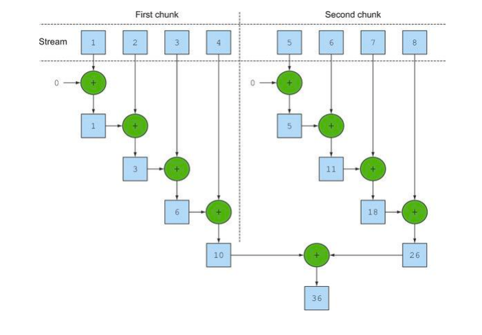
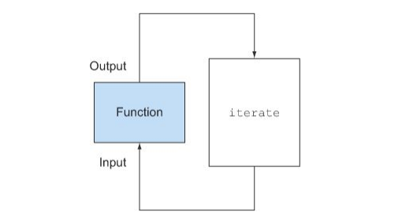
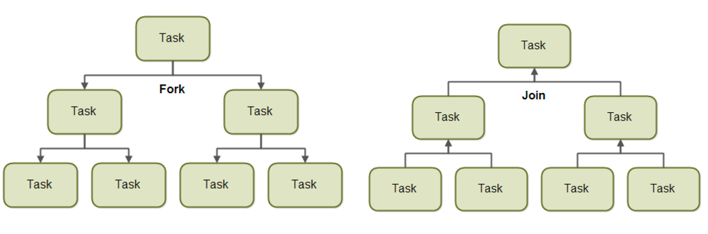

# CH7. 병렬 데이터 처리와 성능
- 병렬 스트림으로 데이터를 병렬 처리하기
- 병렬 스트림의 성능 분석
- 포크/조인 프레임워크
- Spliterator로 스트림 데이터 쪼개기 

새로운 스트림 인터페이스를 이용해서 데이터 컬렉션을 선언형으로 제어하는 방법을 살펴보았다. <br>
외부 반복을 내부 반복으로 바꾸면 컴퓨터의 멀티코어를 활용해서 파이프라인 연산을 실행할 수 있다. <br>
자바 7이 등장 하기 전에는 데이터 컬렉션을 병렬로 처리하기가 어려웠다.
우선 데이터를 서브파트로 분할해야 하고, 분할된 서브파트를 각각의 스레드로 할당한다.  <br>
스레드로 할당한 다음에는 의도치 않은 레이스 컨디션이 발생하지 않도록 적절한 동기화를 추가해야 하고, 마지막으로 부분결과를 합쳐야 한다. <br>
자바7은 더 쉽게 병렬화를 수행하면서 에러를 최소화할 수 있도록 **포크/조인 프레임워크** 기능을 제공한다. <br> <br>
이번 장에서는 스트림으로 데이터 컬렉션 관련 동작을 얼마나 쉽게 병렬로 실행할 수 있는지 설명한다.<br>
스트림을 이용하면 순차 스트림을 병렬 스트림으로 자연스럽게 바꿀 수 있고, 자바 7에 추가된 포크/조인 프레임워크와 내부적인 병렬 스트림 처리는 어떤 관계가 있는지 살펴본다. <br>
우선 여러 청크를 병렬로 처리하기 전에 병렬 스트림이 요소를 여러 청크로 분할하는 방법을 설명할 것이다.

## 병렬 스트림
컬렉션에 parallelStream을 호출하면 병렬 스트림이 생성된다.<br>
**병렬 스트림이란 각각의 스레드에서 처리할 수 있도록 스트림 요소를 여러 청크로 분할한 스트림이다.** <br> 
따라서 병렬 스트림을 이용하면 모든 멀티코어 프로세서가 각각의 청크를 처리하도록 할당할 수 있다. <br>

숫자 n을 인수로 받아서 1부터 n까지의 모든 숫자의 합계를 반환하는 메서드를 구현한다고 가정하자.
```java
public long iterativeSum(long n) {
    long result = 0;
    for (long i = 1L; i < n; i++) {
        result += i;
    }
return result;
```
n이 커진다면 이 연산을 병렬로 처리하는 것이 좋다. 
- 무엇부터 수정해야 하는지
- 결과 변수는 어떻게 동기화 하는지
- 몇 개의 스레드를 사용해야 하는지
- 숫자는 어떻게 생성되고, 생성된 숫자는 누가 더하는지

병렬 스트림을 이용하면 걱정, 근심 없이 모든 문제를 쉽게 해결할 수 있다.

### 순사 스트림을 병렬 스트림으로 변환하기 
```java
public long parallelSum(long n) {
    return Stream.iterate(1L, i => i + 1)
                 .limit(n)
                 .parallel() // 스트림을 병렬 스트림으로 변환
                 .reduce(0L, Long::sum);
```
리듀싱 연산으로 스트림의 모든 숫자를 더하고, 스트림이 여러 청크에 병렬로 수행한다. <br>
마지막으로 리듀싱 연산으로 생성된 부분 결과를 다시 리듀싱 연산으로 합쳐서 전체 스트림의 리듀싱 결과를 도출한다. <br>

<br>
출처: https://javabom.tistory.com/59?category=835783

사실 순차 스트림에 parallel을 호출해도 스트림 자체에는 아무 변화도 일어나지 않는다. 내부적으로 parallel을 호출하면 이후 연산이 병렬로 수행해야 함을 의미하는 불리언 플래그가 설정된다.<br>
반대로 sequential로 병렬 스트림을 순차 스트림으로 바꿀 수 있다. 이 두 메서드를 이용해 어떤 연산을 병렬로 실행하고 어떤 연산을 순차로 실행할지 제어할 수 있다.
```java
stream.parallel()
      .filter(...)
      .sequential()
      .map(...)
      .parallel()
      .reduce();
```
두 메서드 중 최종적으로 호출된 메서드가 전체 파이프라인에 영향을 미친다. 이 예제에서 파이프라인의 마지막 호출은 parallel이므로 파이프라인은 전체적으로 병렬로 실행된다. <br>
> #### 병렬 스트림에서 사용하는 스레드 풀 설정
> 병렬 스트림은 내부적으로 ForkJoinPool 을 사용한다. 기본적으로 ForkJoinPool 은 프로세서 수, 즉 Runtime.getRuntime().availableProcessors()가 반환하는 값에 상응하는 스레드를 갖는다.

### 스트림 성능 측정
반복형, 순차 리듀싱, 병렬 리듀싱 3가지 연산 방법으로 실행 시간을 비교해보자. 
```java
        // for loop 로 실행한 결과(iterativeSum)
        System.out.println("Iterative sum done in: " +
                measureSumPerf(ParallelStreams::iterativeSum, 10_000_000) + " msecs"); // Iterative sum done in: 3 msecs

        // 일반 스트림으로 수행한 결과(sequentialSum)
        System.out.println("Sequential sum done in: " +
                measureSumPerf(ParallelStreams::sequentialSum, 10_000_000) + " msecs"); // Sequential sum done in: 85 msecs


        // 병렬 스트림으로 실행환 결과(parallelSum)
        System.out.println("Parallel sum done in: " +
                measureSumPerf(ParallelStreams::parallelSum, 10_000_000) + " msecs"); // Parallel sum done in: 395 msecs
```
병렬 버전이 순차 버전보다 느린 것을 확인할 수 있다. 다음 두가지 문제가 발생할 수 있다.
- iterate가 박싱된 객체를 생성되므로 숫자를 더하려면 언박싱을 해야 한다.
- 반복 작업은 병렬로 수행할 수 있는 독립 단위로 나누기가 어렵다. (독립적인 청크로 분할하기가 어렵다.)

우리에겐 병렬로 수행될 수 있는 스트림 모델이 필요하기 때문이다. 
특히 이전 연산의 결과에 따라 다음 함수의 입력이 달라지기 때문에 iterate 연산을 청크로 분할하기가 어렵다.

> iterate는 본질적으로 순차적이다.
> <br>
> 이와 같은 상황에서는 리듀싱 연산이 수행되지 않는다. <br>
> 리듀싱 과정을 시작하는 시점에 _전체 숫자 리스트가 준비되지 않았으므로_ 스트림을 병렬로 처리할 수 있도록 청크로 분할할 수 없다. <br>
> 스트림이 병렬로 처리되도록 지시했고 각각의 합계가 다른 스레드에서 수행되었지만 결국 순차처리 방식과 크게 다른 점이 없으므로 스레드를 할당하는 오버헤드만 증가하게 된다.
병렬 프로그래밍을 오용(예를 들어 병렬과 거리가 먼 iterate 작업)하면 오히려 전체 프로그램의 성능이 나빠질 수도 있다.

#### 더 특화된 메서드 사용
멀티코어 프로세서를 활용해서 효과적으로 합계 연산을 병렬로 실행하기 위해서는 `LongStream.rangeClosed` 라는 메서드를 사용한다. 이는 다음과 같은 장점을 제공한다.
- LongStream.rangeClosed 는 기본형 long을 직접 사용하므로 박싱과 언박싱 오버헤드가 사라진다.
- LongStream.rangeClosed 는 쉽게 청크로 분할할 수 있는 숫자 범위를 생성한다. 예를 들어 1-20 범위의 숫자를 1-5, 6-10, 11-15, 16-10 범위의 숫자로 분할할 수 있다. 

```java
        // LongStream.rangeClosed
        System.out.println("Ranged sum done in: " +
                measureSumPerf(ParallelStreams::rangedSum, 10_000_000) + " msecs");     
        // Ranged sum done in: 3 msecs

        // LongStream.rangeClosed 병렬 스트림 적용
        System.out.println("Parallel range sum done in: " +
                measureSumPerf(ParallelStreams::parallelRangedSum, 10_000_000) + " msecs");
        // Parallel range sum done in: 0 msecs
```
순차 실행보다 빠른 성능을 갖는 병렬 리듀싱을 만들었다. 
<br>
하지만 병렬화가 완전 공짜는 아니라는 사실을 기억하자. 병렬화를 이용하려면 스트림을 재귀적으로 분할해야 하고, 
각 서브스트림을 서로 다른 스레드의 리듀싱 연산으로 할당하고, 이들 결과를 하나의 값으로 합쳐야 한다. <br>
따라서 코어 간에 데이터 전송 시간보다 훨씬 오래 걸리는 작업만 병렬로 다른 코어에서 수행하는 것이 바람직하다.

### 병렬 스트림의 올바른 사용법
병렬 스트림을 잘못 사용하면서 발생하는 많은 문제는 공유된 상태를 바꾸는 알고리즘을 사용하기 때문에 일어난다.
```java
public static long sideEffectSum(long n) {
    Accumulator accumulator = new Accumulator();
    LongStream.rangeClosed(1, n).forEach(accumulator::add);
    return accumulator.total;
}

public class Accumulator {
    public long total = 0;
    public void add(long value) { total += value; }
}
```
위 코드는 본질적으로 순차 실행할 수 있도록 구현되어 있어서 병렬로 실행하면 참사가 일어난다. <br>
특히 total을 접근할 때마다 (다수의 스레드에서 동시에 데이터에 접근하는) 데이터 레이스 문제가 일어난다. <br>
동기화로 문제를 해결한다면 결국 병렬화라는 특성이 없어질 것이다. <br><br>
우선은 병렬 스트림이 올바로 동작하려면 공유된 가변 상태를 피해야 한다는 사실만 기억하자. 이제 어떤 상황에서 병렬 스트림을 사용해야 적절한 성능 개선을 얻을 수 있는지 살펴보자. 

### 병렬 스트림 효과적으로 사용하기
- 확신이 서지 않는다면 적절한 벤치마크로 직접 성능 측정하기
- 박싱 주의하기, 되도록이면 기본형 특화 스트림을 사용하기
- 순차 스트림보다 병렬 스트림에서 성능이 떨어지는 연산이 있다. 특히 limit이나 findFirst처럼 **요소의 순서** 에 의존하는 연산을 병렬 스트림에서 수행하려면 비싼 비용을 치러야 한다. 
- 스트림에서 수행하는 전체 파이프라인 연산 비용을 고려하자. 처리해야 할 요소 수가 N이고 하나의 요소를 처리하는 데 드는 비용을 Q라 하면 전체 스트림 파이프라인 처리 비용을 N*Q로 예상할 수 있다. <br>
Q가 높아진다는 것은 병렬 스트림으로 성능을 개선할 수 있는 가능성이 있음을 의미한다.
- 소량의 데이터에서는 병렬 스트림이 도움되지 않는다. 
- 스트림을 구성하는 자료구조가 적절한지 확인하자. LinkedList를 분할하려면 모든 요소를 탐색해야 하지만, ArrayList는 요소를 탐색하지 않고도 리스트를 분할할 수 있다.
- 스트림의 특성과 파이프라인의 중간 연산이 스트림의 특성을 어떻게 바꾸는지에 따라 분해 과정의 성능이 달라질 수 있다. <br>
  필터 연산이 있으면 스트림의 길이를 예측할 수 없으므로 효과적으로 스트림을 병렬 처리할 수 있을지 알 수 없게 된다.
- 최종 연산의 병합 과정 비용을 살펴보자. 병합 과정의 비용이 비싸다면 병렬 스트림으로 얻은 성능의 이익이 서브스트림의 부분 결과를 합치는 과정에서 상쇄될 수 있다.

## 포크/조인 프레임워크
포크/조인 프레임워크는 병렬화할 수 있는 작업을 재귀적으로 작은 작업으로 분할한 다음에 서브태스크 각각의 결과를 합쳐서 전체 결과를 만들도록 설계됐다. <br>
포크/조인 프레임워크에서는 서브태스크를 스레드 풀(ForkJoinPool)의 작업자 스레드에 분산 할당하는 ExecutorService 인터페이스를 구현한다.
<br>
출처: https://hamait.tistory.com/612
### RecursiveTask 활용
스레드 풀을 이용하려면 `RecursiveTask<R>`의 서브클래스를 만들어야 한다. 여기서 R은 병렬화된 태스크가 생성하는 결과가 없을 때(결과가 없더라도 다른 비지역 구조를 바꿀수 있다)는 RecursiveAction 형식이다.<br>
RecursiveTask를 정의하려면 추상 메서드 compute를 구현해야 한다. 
```java
protected abstract R compute();
```
compute 메서드는 태스크를 서브태스크로 분할하는 로직과 더이상 분할할 수 없을 때 개별 서브태스크의 결과를 생산할 알고리즘을 정의한다. <br>
따라서 대부분의 compute 메서드 구현은 다음과 같은 의사코드 형식을 유지한다. 
```java
if (태스크가 충분히 작거나 더 이상 분할할 수 없으면) {
    순차적으로 태스크 계산
} else {
    태스크를 두 서브태스크로 분할
    태스크가 다시 서브태스크로 분할되도록 이 메서드를 재귀적으로 호출함
    모든 서브태스크의 연산이 완료될 때까지 기다림
    각 서브태스크의 결과를 합침
}
```
이 알고리즘은 분할 후 정복 알고리즘의 병렬화 버전이다.

### 포크/조인 프레임워크를 제대로 사용하는 방법
포크/조인 프레임워크는 쉽게 사용할 수 있는 편이지만 항상 주의를 기울여야 한다.
- Join 메서드를 태스크에 호출하면 태스크가 생산하는 결과가 준비될 때까지 호출자를 블록시킨다. 따라서 두 서브태스크가 모두 시작된 다음에 join을 호출해야 한다.
- RecursiveTask 내에서는 ForkJoinPool의 invoke 메서드를 사용하지 말아야 한다. 순차 코드에서 병렬 계산을 시작할 때만 invoke를 사용한다.
- 서브태스크에 fork 메서드를 호출해서 ForkJoinPool의 일정을 조절할 수 있다.
- 포크/조인 프레임워크를 이용하는 병렬 계산은 디버깅하기 어렵다.
- 병렬 스트림에서 살펴본 것처럼 멀티코어에 포크/조인 프레임워크를 사용하는 것이 순차처리보다 무조건 빠를 거라는 생각은 버려야 한다.

## Spliterator
자바 8에서는 Spliterator라는 새로운 인터페이스를 제공한다. Iterator처럼 Spliterator는 소스의 요소 탐색 기능을 제공한다는 점은 같지만 Spliterator는 **병렬 작업에 특화** 되어 있다.
```java
public interface Spliterator<T> {
    boolean tryAdvance(Consumer<? super T> action); // Spliterator의 요소를 하나씩 순차적으로 소비하면서 탐색해야 할 요소가 남아있으면 참을 반환한다. 
    Spliterator<T> trySplit();                      // Spliterator의 일부 요소(자신이 반환한 요소)를 분할해서 두 번째 Spliterator를 생성하는 메서드다.
    long estimateSize();                            // 탐색해야 할 요소 수 정보 제공
    int characteristics();                          // Spliterator 자체의 특성 집합을 포함하는 int 반환 
}
```
T는 Spliterator에서 탐색하는 요소의 형식을 가리킨다. <br>


### 핵심 정리
- 내부 반복을 이용하면 명시적으로 다른 스레드를 사용하지 않고도 스트림을 병렬로 처리할 수 있다.
- 간단하게 스트림을 병렬로 처리할 수 있지만 항상 병렬 처리가 빠른 것은 아니다. 병렬 소프트웨어 동작 방법과 성능은 직관적이지 않을 때가 많으므로, 병렬 처리를 사용했을 때 성능을 직접 측정해봐야 한다.
- 병렬 스트림으로 데이터 집합을 병렬 실행할 때 특히 처리해야 할 데이터가 아주 많거나, 각 요소를 처리하는 데 오랜 시간이 걸릴 때 성능을 높일 수 있다.
- 가능하면 기본형 특화 스트림을 사용하는 등 올바른 자료구조 선택이 어떤 연산을 병렬로 처리하는 것보다 성능적으로 더 큰 영향을 미칠 수 있다.
- 포크/조인 프레임워크에서는 병렬화할 수 있는 태스크를 작은 태스크로 분할한 다음에 분할된 태스크를 각각의 스레드로 실행하며 서브태스크 각각의 결과를 합쳐서 최종 결과를 생산한다.
- Spliterator는 탐색하려는 데이터를 포함하는 스트림을 어떻게 병렬화할 것인지 정의한다. 
